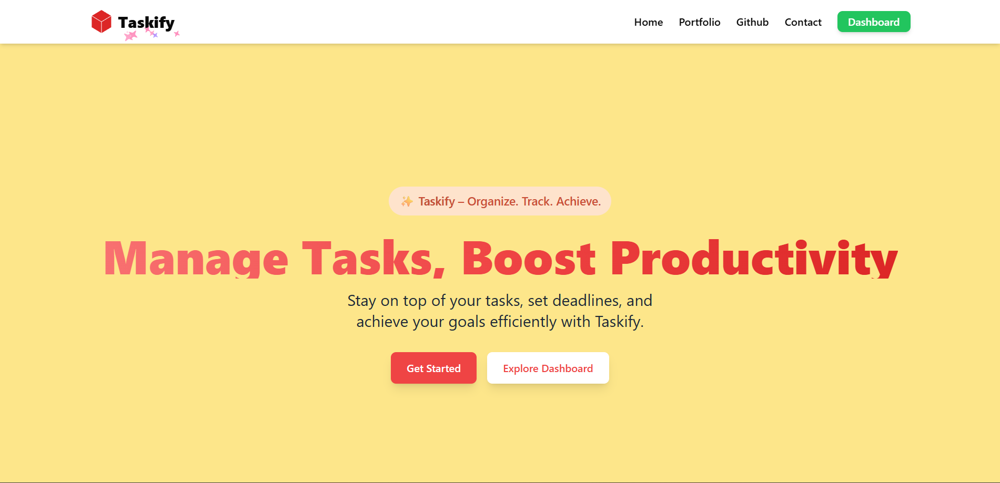
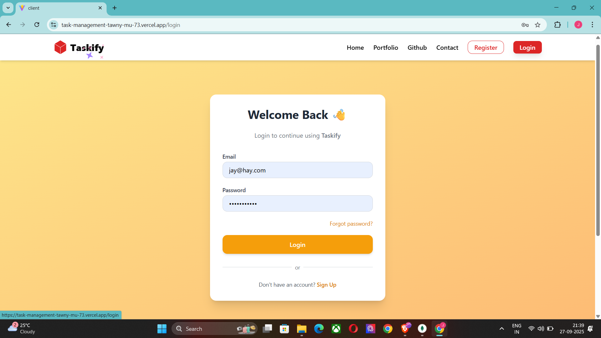
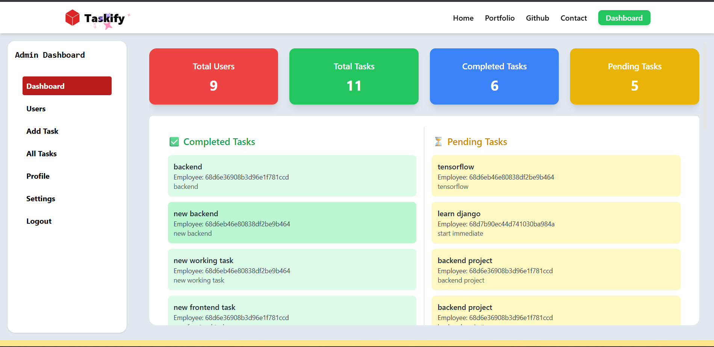

# 📝 Taskify – Task Management App  

Taskify is a full-stack task management application built with **React (Vite)** for the frontend and **Node.js, Express.js, MongoDB** for the backend.  
It allows **users** to create and manage tasks, and provides an **admin dashboard** to monitor all users and tasks.  

---

## 🚀 Features  

## 📸 Screenshots  

### 🔑 Home Page  
  

### 📋 User login
  

### 👨‍💼 Admin Dashboard  
  


### 👤 User  
- Sign up & Login with JWT authentication  
- View personal profile  
- Create, update, and delete tasks  
- Mark tasks as **Completed** or **Pending**  
- View task history  

### 👨‍💼 Admin  
- Dashboard to view all users  
- Dashboard to view all tasks with details (user, status, created date)  
- Search users by ID  
- Manage and monitor activities  

---

## 🛠️ Tech Stack  

### Frontend (client)  
- ⚛️ React (Vite)  
- 🎨 Tailwind CSS  
- 🔗 Axios (API calls)  
- 📦 React Router  

### Backend (server)  
- 🟢 Node.js + Express.js  
- 🗄 MongoDB (Mongoose ODM)  
- 🔐 JWT Authentication  
- 🌐 CORS  

### Deployment  
- Frontend → Vercel  
- Backend → Render / Railway / Vercel (Node.js server)  
- Database → MongoDB Atlas  

---

## 📂 Project Structure  

Taskify/
│
├── client/ # Frontend (React + Vite)
│ ├── src/
│ │ ├── components/ # Navbar, Footer, UI
│ │ ├── pages/ # User & Admin pages
│ │ ├── api/ # Axios API calls
│ │ └── App.jsx
│ └── package.json
│
├── server/ # Backend (Express + MongoDB)
│ ├── models/ # User & Task schemas
│ ├── routes/ # API routes
│ ├── controllers/ # Business logic
│ ├── middleware/ # Auth middleware
│ └── server.js
│
├── logs/ # Build & deployment logs
│ ├── build.log
│ ├── dev.log
│ ├── vercel.log
│ └── backend-dev.log
│
└── README.md


---

## ⚡ Installation & Setup  

### 1️⃣ Clone repo  
```bash
git clone https://github.com/your-username/taskify.git
cd taskify
cd client
npm install
npm run dev


cd server
npm install
npm start


API Endpoints
🔹 User APIs

POST /api/v1/auth/register → Register

POST /api/v1/auth/login → Login

GET /api/v1/tasks → Get user tasks

PUT /api/v1/task/:id → Update task status

🔹 Admin APIs

GET /api/v1/admin/users → Get all users

GET /api/v1/admin/tasks → Get all tasks

GET /api/v1/admin/search/single/:id → Get user by ID

📦 Logs

Logs are included in the logs/ folder:

build.log → Frontend build log

dev.log → Frontend dev server log

vercel.log → Vercel deployment log

backend-dev.log → Backend server log

👨‍💻 Author

Jay Kashyap

GitHub

Portfolio

LinkedIn


---

👉 You can copy this into a file named **`README.md`** inside your repo root.  

Do you also want me to **add log generation commands** (like `npm run build > logs/build.log 2>&1`) i
